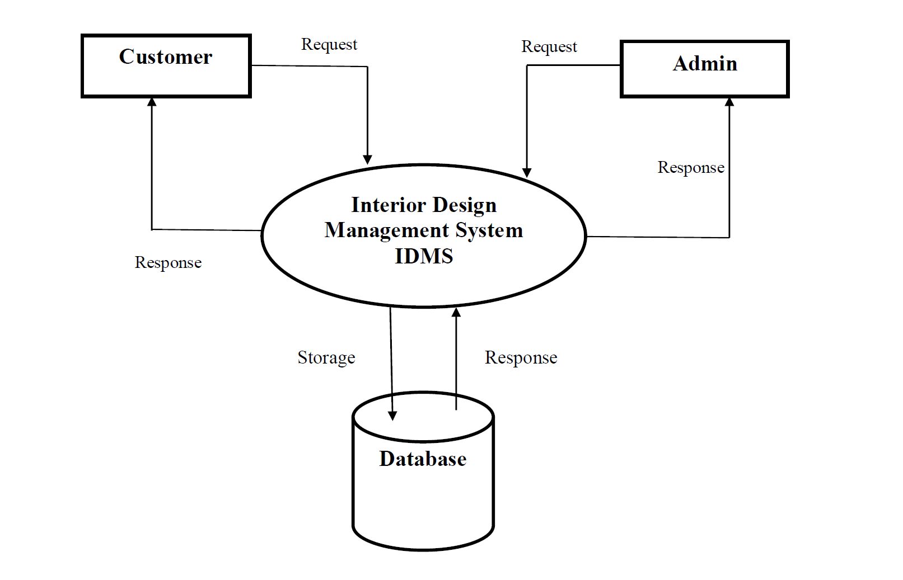

# Interior-design

Interior design management system provides information customers about Interior design products. It allows user to search based on various filter elements. All the specification of Interior design is displayed on the screen, which helps user decide which Interior design product will suit his needs. Interior design system already has over 20+ Interior design in its database along with their detailed specification and images. Admin login is done to manage interior designs and user data.

## ADMINISTRATOR MODULE

This module provides administrator related functionality. Administrator manages all information and has access rights to add, delete, edit and view the data related to projects, clients, customers/users, interiors etc.
Projects- Admin will create the packages and Manage the packages (Create, Update, delete)
Users- Admin can view all Information of all users.
interiors- Admin will responsible for manage interiors. Admin can edit and cancel interior designs.
Change password- Admin can change own password.

## USER MODULE

View- user can view all interior designs that will show in welcome. User can apply filter to search required interior designs.
Contact-us -Here user can raise any issue related to interior designs.

## Technologies used
* HTML
* JavaScript
* CSS
* MYSQL
* Apache Server

## System Model

### System Architecture

### E-R Diagram

## SCREEN SHOTS

### Home Page

### Product Page

### Admin LoginIn Page

### Dashboard

### Manage Product

## Purpose of project

I have developed this project during my 7th semester of computer science engineering for the completion of acadamic mini-project.

## CONCLUSION

Interior design management system is an application which has 2 modules i.e. Administrator module and User module. Administrator manages all information and has access rights to add,delete, edit and view the data related to projects, clients, customers/users, interiors etc. User can view all the interior design and also can apply filter to choose required interior design.Users can contact admin through contact form.In future, project can be extended to maintain all the details of a interior designs in the system. The future version will include storing the details of all the interiors which attract customer etc.
